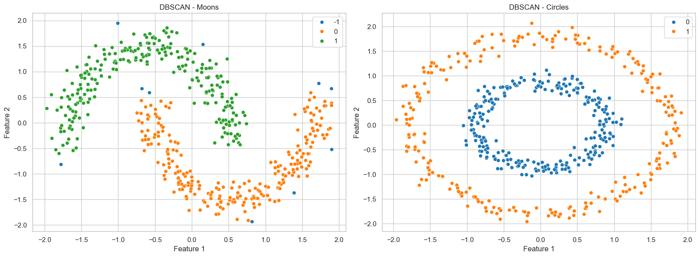

# DBSCAN Clustering on Moons and Circles

This project demonstrates the application of **DBSCAN (Density-Based Spatial Clustering of Applications with Noise)** to identify non-linear cluster structures in synthetic datasets: **Moons** and **Circles**.

---

## 1. Objective

To effectively cluster **non-linear**, **non-convex** datasets without predefined cluster counts and handle noisy data points using DBSCAN.

---

## 2. Datasets

### Moons Dataset
- Two interleaving half-circle shapes.
- Commonly used to demonstrate the limitations of K-Means and advantages of DBSCAN.

### Circles Dataset
- Two concentric circles with varying density.
- A challenging dataset for conventional clustering algorithms due to its non-linear nature.

---

## 3. Methodology

### Data Generation
- **Moons**: 500 samples with noise = 0.1
- **Circles**: 500 samples with noise = 0.05, factor = 0.5
- Data was standardized for fair distance-based clustering.

### DBSCAN Parameters
- **Epsilon (eps)**: Radius of neighborhood for each point.
- **Min Samples**: Minimum points to form a dense region.
- **Distance Metric**: Euclidean (default)

---

## 4. Results

### Clustering Visualization

- **Moons**:
  - Cluster 0 (Orange): Lower arc
  - Cluster 1 (Green): Upper arc
  - Noise (Blue): Outliers scattered around the edges

- **Circles**:
  - Cluster 0 (Blue): Inner circle
  - Cluster 1 (Orange): Outer circle

### Silhouette Scores
- **Moons**: **0.306** (Moderate clustering quality)
- **Circles**: **0.113** (Low clustering quality, likely due to overlapping boundaries)

---

## 5. Analysis

### Moons Dataset
- Successfully captured the two distinct arcs.
- Some isolated points were correctly identified as **noise**.
- The moderate silhouette score reflects **good cluster separation** but with some boundary confusion.

### Circles Dataset
- Clearly separated the two concentric rings.
- Low silhouette score suggests **cluster boundary overlap** or high intra-cluster distance variation.

---

## 6. Key Takeaways

- **DBSCAN Strengths**:
  - Handles **non-linear shapes** effectively.
  - Automatically identifies **noise** without requiring a predefined number of clusters.
- **Areas for Improvement**:
  - **Parameter Tuning**: Adjusting `eps` and `min_samples` for better cluster definition.
  - Consider alternative algorithms like **HDBSCAN** for more complex density variations.
