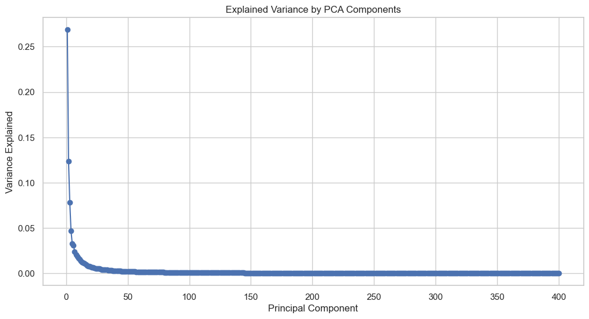
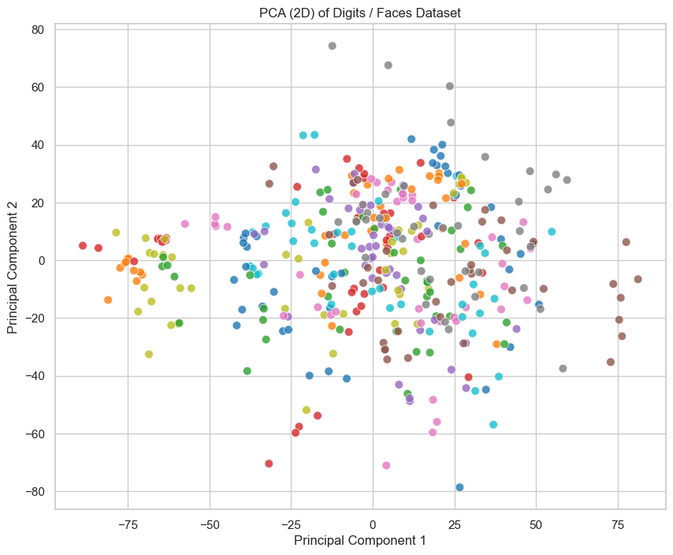
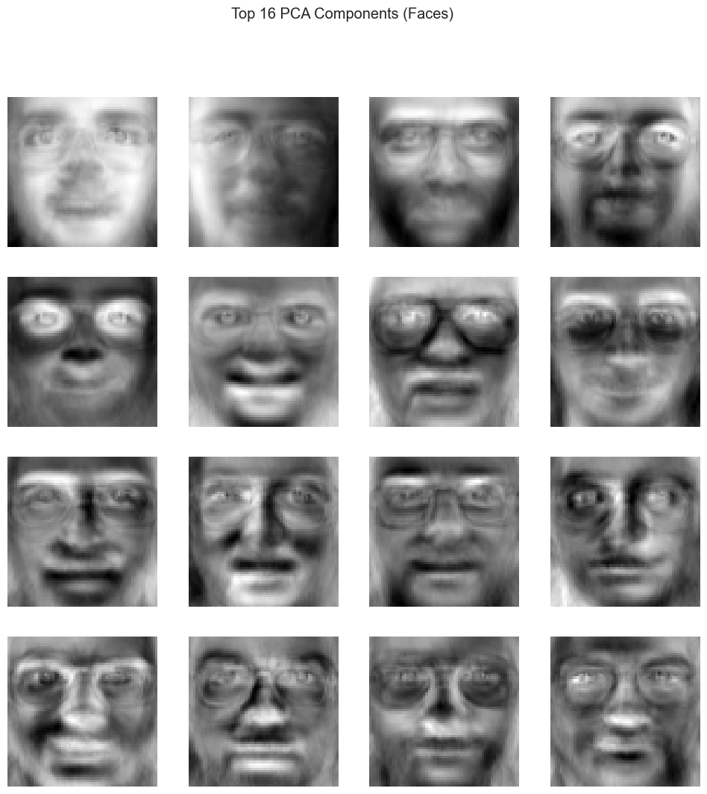

# Principal Component Analysis (PCA) on Faces Dataset

This project demonstrates the application of **Principal Component Analysis (PCA)** for **dimensionality reduction** and **feature extraction** using the **Olivetti Faces** dataset from **Scikit-learn**.

---

## 1. Dataset

### **Olivetti Faces (Scikit-learn)**

- **Samples**: 400 grayscale face images
- **Resolution**: 64x64 pixels (4,096 features per image)
- **Classes**: 40 distinct individuals
- **Challenge**: High dimensionality, facial variation in **pose**, **lighting**, **expression**, and **age**

---

## 2. Methodology

### **Principal Component Analysis (PCA)**

- **Goal**: Reduce the high-dimensional face images to a more compact, meaningful representation.
- **Key Steps**:
  - Standardize the data to **zero mean** and **unit variance**
  - Fit PCA to extract **principal components** (eigenfaces)
  - Visualize **explained variance** and **top components**

---

## 3. Results

### **Explained Variance by PCA Components**

- **Key Observations**:
  - The **first few components** capture the majority of the variance.
  - The curve **flattens** quickly after the first 20 components, indicating **diminishing returns** for additional components.
  - The first component alone captures **more than 25%** of the variance, while the top 10 components capture most of the **meaningful structure** in the data.

---

### **2D PCA Projection**

- **Key Observations**:
  - Data points are **well spread out**, suggesting that the PCA effectively captures the high-dimensional relationships in a **low-dimensional space**.
  - Clusters are present, but some overlap exists, reflecting the complex nature of face data.
  - The variation along **PC1** and **PC2** captures major facial differences, potentially related to **age**, **lighting**, or **pose**.

---

### **Top 16 PCA Components (Faces)**

- **Key Observations**:
  - The components capture **global facial features** like **glasses**, **facial structure**, and **shadow patterns**.
  - The first few components are **sharper** and capture more **general** features (e.g., glasses, head shape).
  - Later components capture **finer**, more **local** features, like **wrinkles** and **eye shape**.
  - These components form the **basis** of the PCA transformation, allowing the original high-dimensional faces to be compressed effectively.

---

## 4. Key Takeaways

- **PCA** is highly effective for reducing the dimensionality of **high-dimensional** image data.
- The first few components capture the **most critical** features, while later components capture **finer details**.
- This dimensionality reduction makes subsequent machine learning tasks like **classification** or **clustering** significantly more efficient.

---

## 5. Next Steps

- **Classification**: Use these components to train a face recognition model.
- **Clustering**: Group similar faces based on PCA features.
- **Reconstruction**: Visualize how well the original faces can be reconstructed using a limited number of components.

