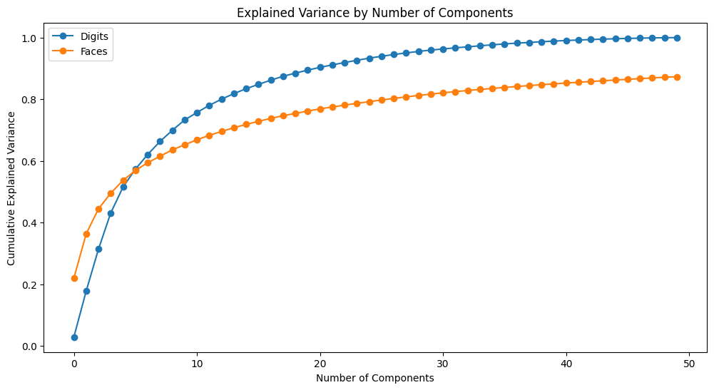

# SVD Image Compression Analysis

This project demonstrates the application of **Singular Value Decomposition (SVD)** for **image compression** using the **Digits** and **Olivetti Faces** datasets from **Scikit-learn**. SVD effectively reduces the **dimensionality** of high-dimensional data while retaining most of the **critical features**, making it a powerful technique for image compression.

---

## 1. Dataset

### **Digits (8x8 grayscale)**

- **Samples**: 1,797
- **Resolution**: 8x8 pixels (64 features per image)
- **Classes**: 10 digits (0-9)
- **Characteristics**: Simple, binary-like structures

### **Olivetti Faces (64x64 grayscale)**

- **Samples**: 400
- **Resolution**: 64x64 pixels (4,096 features per image)
- **Classes**: 40 distinct individuals
- **Characteristics**: High-dimensional, complex textures

---

## 2. Methodology

### **Singular Value Decomposition (SVD)**

- **Goal**: Reduce the dimensionality of images while retaining critical features.
- **Steps**:
  - Standardize the data to **zero mean** and **unit variance**
  - Use **Truncated SVD** to compress the data
  - Reconstruct the images from the compressed representation
  - Evaluate the quality using **Mean Squared Error (MSE)**

---

## 3. Results

### **Cumulative Explained Variance**

- **Digits** (blue line):
  - Reaches nearly **100%** explained variance with around **40 components**, indicating a **highly structured** and **low-dimensional** nature.
  - The curve **rises sharply** in the first 10 components, capturing the majority of the information quickly.

- **Faces** (orange line):
  - Reaches about **90%** explained variance at **50 components**, suggesting it requires more components for accurate reconstruction.
  - The curve is **less steep** compared to the Digits, reflecting the **complexity** and **higher variability** in facial images.

---

### **Mean Squared Error (MSE)**

- **Digits MSE**: **0.0085**
- **Faces MSE**: **0.0024**

- **Key Observations**:
  - **Digits** have a slightly **higher MSE**, despite requiring fewer components to capture most of the variance. This is likely because the digits are more **binary** and **sensitive** to small pixel changes.
  - **Faces** have a **lower MSE**, which suggests that even with fewer components, the overall **structure** and **details** of faces can be more effectively preserved.
  - This lower MSE for faces may also reflect the fact that human faces share **many common structural features** that can be captured more efficiently.

---

## 4. Key Takeaways

- **Digits** are **low-dimensional** and require fewer components for accurate reconstruction, but small errors can significantly affect their appearance due to their **sharp boundaries**.
- **Faces** are **high-dimensional** with **smooth gradients** and **complex textures**, which makes them more compressible without a significant loss in **visual quality**.
- This difference in MSE highlights the **trade-off** between dimensionality and perceptual quality, making SVD a **powerful** tool for **image compression** in various contexts.
